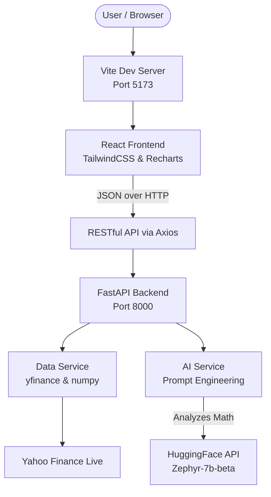

# RealTicker AI Stock Insights

RealTicker is an AI-powered financial dashboard built for modern investors. It synthesizes real-time market data alongside an integrated AI Analyst to provide actionable metrics on trend and volatility.

## 📸 Screenshots

  
" width="800" alt="Dashboard View">
  
<em>Real-Time Top Performers Dashboard</em>

  
" width="800" alt="Stock Detail View">
  
<em>6-Month Historical Chart & Analytics</em>

  
" width="800" alt="Generated AI Insights">
  
<em>HuggingFace Zephyr-7B generated Investment Strategy</em>

## 🏗️ Architecture

## 🧠 LLM Used
We dynamically pipeline statistical aggregations directly into **HuggingFaceH4/zephyr-7b-beta** (Zephyr 7B). Our custom integration provides it with localized Annualized Volatility and Linear Regression slopes so it deduces genuine insights instead of hallucinating. Fallback algorithms handle native heuristic processing safely if token caps are reached.

## ⚙️ Setup Steps

### Prerequisites
- Node.js & npm (v18+)
- Python 3.10+
- (Optional) Hugging Face API Token

### 1. Backend Setup
Navigate to the `backend` directory, install requirements, and start the Uvicorn server:
`bash
cd backend
pip install -r requirements.txt
python -m uvicorn main:app --port 8000 --reload
`
*Note: To inject actual AI processing logic, create a `.env` in the backend folder stating `HUGGINGFACE_API_KEY=your_key`.*

### 2. Frontend Setup
Open a new terminal window, navigate to the `frontend` directory, and start the dev interface:
`bash
cd frontend
npm install
npm run dev
`
The application will safely spin up locally at `http://localhost:5173`!
